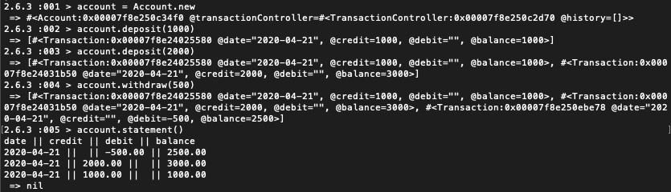

# Bank Tech Test
## Challenge specification: 
https://github.com/makersacademy/course/blob/master/individual_challenges/bank_tech_test.md

### Summary
An application where a user and deposit, withdraw and see a statment from an account.

## Features

- A user can create an account
- A user can deposit a numerical vaule into that account
- A user can withdraw a numerical value from that account
- A user can view a statment showing the date, amount and balance of the account for each transaction

## Approach
The application was built using Ruby and run using IRB.


## Testing

## Rspec

In terminal, run rspec to check all the tests are passing

```bash
$ rspec
```

### Feature Test

```
irb -r './lib/account.rb'
account = Account.new
account.deposit(1000)
account.deposit(2000)
account.withdraw(500)
account.statement()
```
Expected output:

```
date || credit || debit || balance
2020-04-20 || 1000.00 ||  || 1000.00
2020-04-20 || 2000.00 ||  || 3000.00
2020-04-20 ||  || 500.00 || 2500.00
```

## Setup

In terminal:

```bash
$ bundle install
```

## Running the application



- Start IRB
```bash
$ irb -r './lib/account.rb'
```

- Create an account
```ruby
account = Account.new
```
- Deposit into the account
```ruby
account.deposit(1000)
```

- Withdraw from the account

```ruby
account.withdraw(500)
```

- View Statement

```ruby
account.statement
```

Output:
```
date || credit || debit || balance
2020-04-20 || 1000 || 0 || 1000
2020-04-20 || 0 || 500 || 500
```

